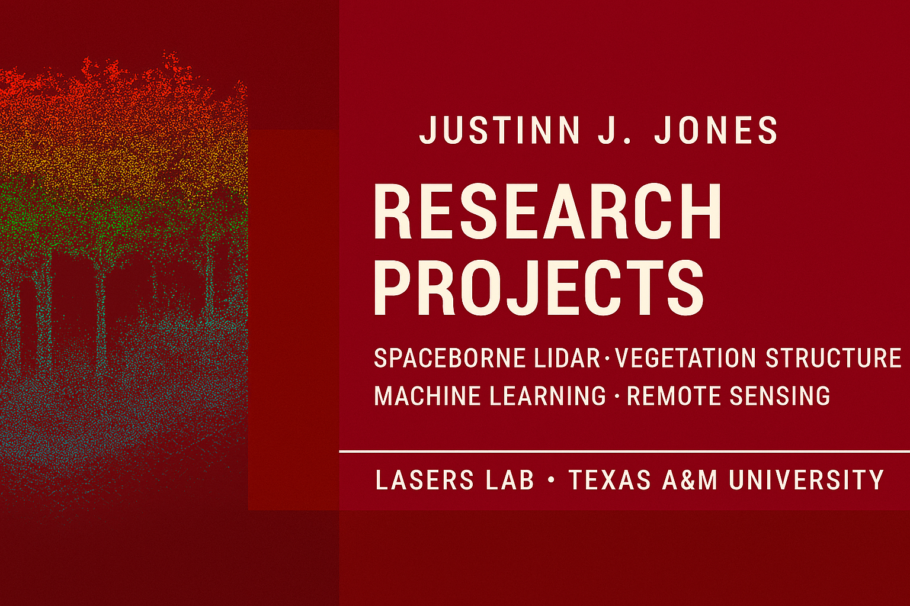

  

# Research Projects by Justinn J. Jones

Welcome to my central repository for **research projects, publications, datasets, and open‑source geospatial workflows**.  
This landing page links to all of my GitHub project repositories and Zenodo‑archived research artifacts, including work with **spaceborne lidar (ICESat‑2, GEDI)**, **mobile lidar**, **urban forestry**, and **machine learning for vegetation assessment**.

---

## 🌲 Featured Projects

### **1. Spaceborne Lidar for Vegetation Assessment (Workshop)**
Repository: https://github.com/justinn-j-jones/Spaceborne-lidar-for-vegetation-assessment  
Zenodo DOI: https://doi.org/10.5281/zenodo.19099501  
Description:  
Instructional materials and Jupyter notebooks demonstrating workflows with **ICESat‑2 ATL08**, **GEDI L2A/L2B**, **Google Earth Engine**, and **machine learning** for vegetation structure modeling.

---

### **2. Toward Fully Automated Urban Tree Inventory (UFUG 2026)**
Repository: https://github.com/justinn-j-jones/Toward_fully_automated_urban_tree_inv_-_UFUG-2026  
Zenodo DOI: https://doi.org/10.5281/zenodo.19121499  
Publication DOI: https://doi.org/10.1016/j.ufug.2026.129362  
Description:  
Supporting notebooks and workflows for urban tree inventory using **mobile lidar (MLS)**, **lidR**, **TreeLS**, and automated tree‑feature extraction.

---

## 📁 About This Repository

This repository serves as a **high‑level index** for my research work.  
Rather than storing code directly here, this page links to dedicated repositories for each project, each containing:

- Notebooks  
- Code (Python / R)  
- Documentation  
- Sample datasets  
- Zenodo DOIs  
- Citation files  
- Publication links (when applicable)

This approach provides clean project separation while maintaining a single, easy‑to‑navigate landing page.

---

## 🔗 Additional Research Outputs (More projects coming soon)

- (Future project placeholder)  
- (Thesis‑related workflows)  
- (Google Earth Engine scripts)  
- (ICESat‑2 and GEDI comparison tools)  
- (Machine learning models for canopy height prediction)

This repository will continue to be updated as new workflows, datasets, and publications are released.

---

## 🧑‍💻 About Me

**Justinn J. Jones**  
Graduate Assistant – Research  
Texas A&M University, LASERS Lab  
ORCID: https://orcid.org/0009-0007-5032-6657  
Lab Website: https://lasers.tamu.edu/

My research focuses on:

- Spaceborne and airborne lidar  
- Automated tree inventory  
- Urban and forest ecology  
- Machine learning for vegetation assessment  
- Open‑source geospatial analysis  
- Cloud‑based remote sensing workflows

---

## 📬 Contact

If you have questions, collaboration requests, or would like to use any of these workflows in your research or teaching:

📧 justinn.j.jones@tamu.edu  
Or open an issue in the corresponding GitHub project repository.

---

## 📝 License

All repositories linked here include individual licenses (typically **MIT License**) allowing reuse, modification, and distribution.  
When using any project, please cite the associated Zenodo DOI and publication (if applicable).
